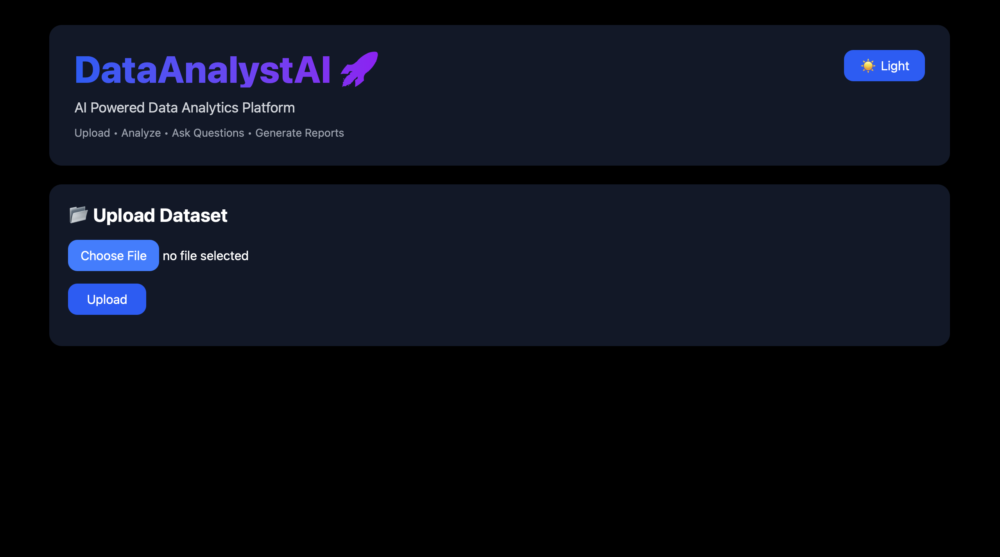
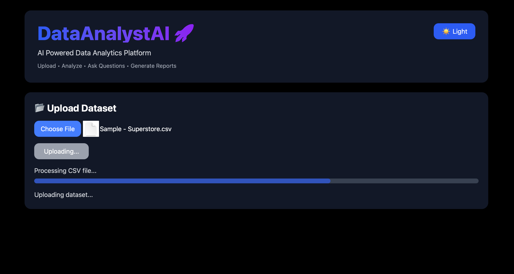
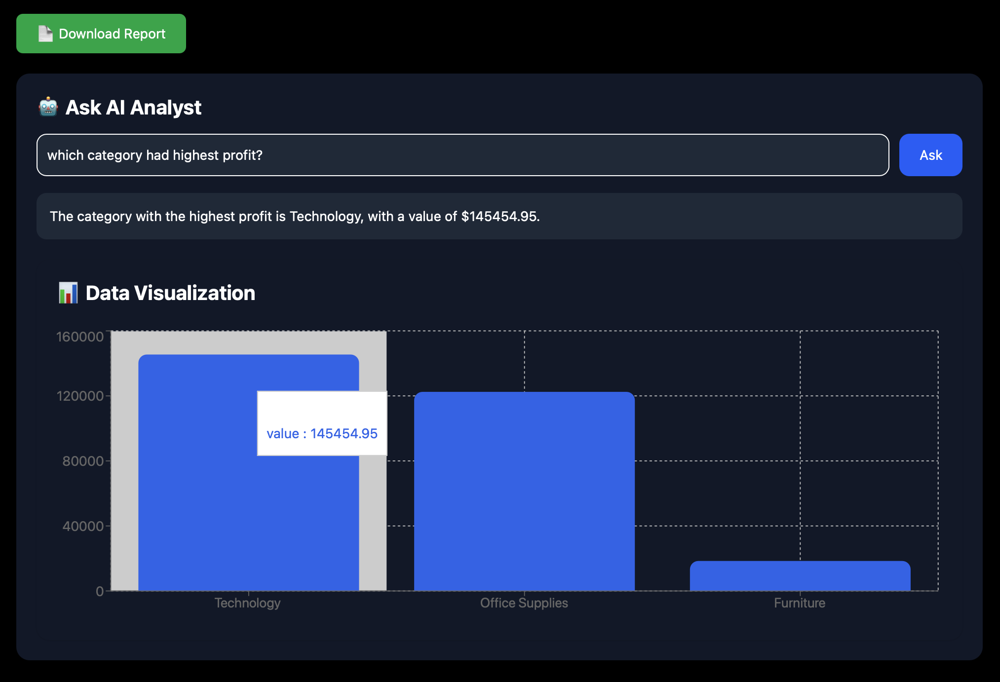
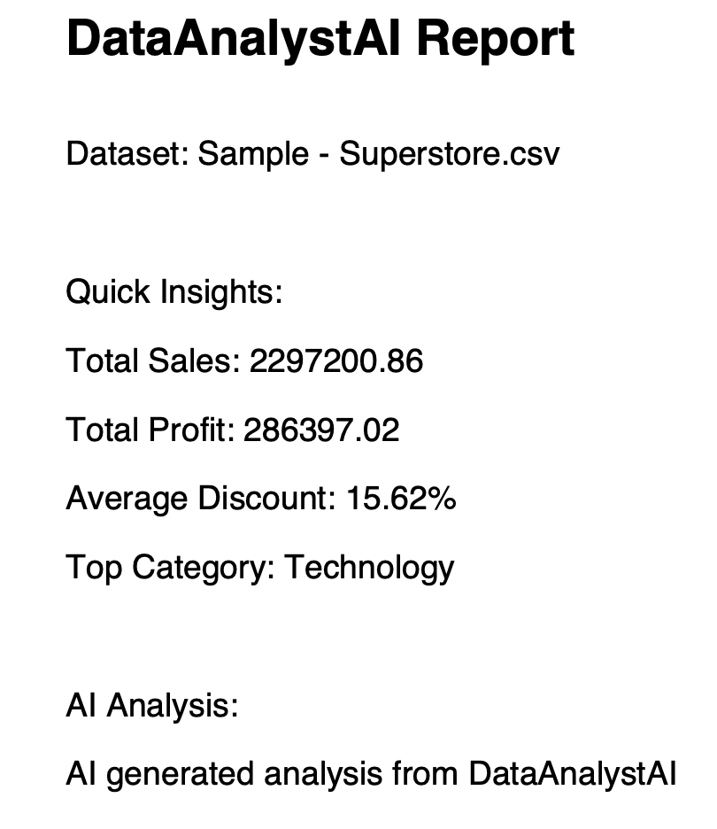

Copy everything below into your `README.md`:

````md
# DataAnalystAI 🚀

AI Powered Data Analytics Platform that allows users to upload datasets, analyze data, ask questions using natural language, generate visualizations, and create reports.

---

## ✨ Features

### 📂 Dataset Upload
- Upload CSV datasets
- Automatic dataset processing
- Stores dataset session for analysis

### 📊 Data Profiling
- Row and column information
- Missing value detection
- Duplicate row detection
- Dataset overview

### 📈 Data Analysis
- Automatic statistics generation
- Group-based analysis
- Sales, profit, and metric calculations

### 🤖 AI Data Analyst

Ask questions about your dataset using natural language.

Example:

```
Question:
Which region has the highest sales?

Answer:
West region has the highest sales based on the dataset analysis.
```

The AI explains results generated from actual Python analysis.

---

### 📉 Interactive Charts
- Automatic chart generation
- Visual representation of analysis results
- Dashboard-based visualization

---

### 💡 Insights Dashboard

Displays important business metrics:

- Total Sales
- Total Profit
- Average Discount
- Top Category

---

### 📄 Report Generation

- Generate AI-powered analysis reports
- Download reports from dashboard

---

### 🌙 Theme Support

- Light mode
- Dark mode

---
# 📸 Screenshots

## Dashboard



---

## Dataset Upload



---

## AI Chat Analyst



---

## Insights Dashboard


---

## Report Generation



---
## Data Visualization


# 🏗️ Project Architecture

```
DataAnalystAI

├── backend
│
│   ├── api
│   │   ├── upload.py
│   │   └── ask.py
│   │
│   ├── services
│   │   ├── data_loader.py
│   │   ├── profiler.py
│   │   ├── statistics.py
│   │   ├── ai_service.py
│   │   ├── chart_service.py
│   │   ├── report_service.py
│   │   ├── session_manager.py
│   │   └── tool_registry.py
│   │
│   ├── models
│   │
│   └── main.py
│
└── frontend
    │
    ├── src
    │   │
    │   ├── components
    │   │   ├── Upload.jsx
    │   │   ├── Chat.jsx
    │   │   ├── Chart.jsx
    │   │   ├── DatasetCard.jsx
    │   │   ├── InsightsCard.jsx
    │   │   ├── ReportButton.jsx
    │   │   └── ThemeToggle.jsx
    │   │
    │   ├── App.jsx
    │   └── main.jsx
    │
    └── package.json
```

---

# 🛠️ Tech Stack

## Frontend

- React
- Vite
- Tailwind CSS
- Framer Motion
- Recharts

## Backend

- FastAPI
- Python
- Pandas
- Uvicorn

## AI

- Ollama
- Llama 3.2

---

# 🚀 Installation

## Backend Setup

Clone the repository:

```bash
git clone <repository-url>

cd DataAnalystAI
```

Navigate to backend:

```bash
cd backend
```

Create virtual environment:

```bash
python3 -m venv venv
```

Activate environment:

Mac/Linux:

```bash
source venv/bin/activate
```

Install dependencies:

```bash
pip install -r requirements.txt
```

Run backend:

```bash
uvicorn backend.main:app --reload
```

Backend runs at:

```
http://localhost:8000
```

---

# Frontend Setup

Navigate to frontend:

```bash
cd frontend
```

Install packages:

```bash
npm install
```

Start development server:

```bash
npm run dev
```

Frontend runs at:

```
http://localhost:5173
```

---

# 📌 How It Works

1. User uploads a CSV dataset
2. Backend loads and profiles the dataset
3. Statistics are generated using Python
4. User asks questions in natural language
5. AI explains the calculated results
6. Charts and insights are displayed
7. Reports can be generated and downloaded

---

# 📊 Tested Dataset

Currently tested with:

```
Sample-Superstore.csv
```

Dataset:

- Rows: 9994
- Columns: 21

---

# 🔥 Example Questions

```
Which region has the highest sales?

Which category has the highest profit?

Show me sales performance by region.

What is the average discount?
```

---

# 🔮 Future Improvements

- Excel and JSON file support
- SQL database connections
- User authentication
- Cloud deployment
- Advanced machine learning predictions
- More visualization options
- Multiple AI model support

---

# 👨‍💻 Author

Mohammed Taif

---

⭐ Built with React + FastAPI + AI
````
